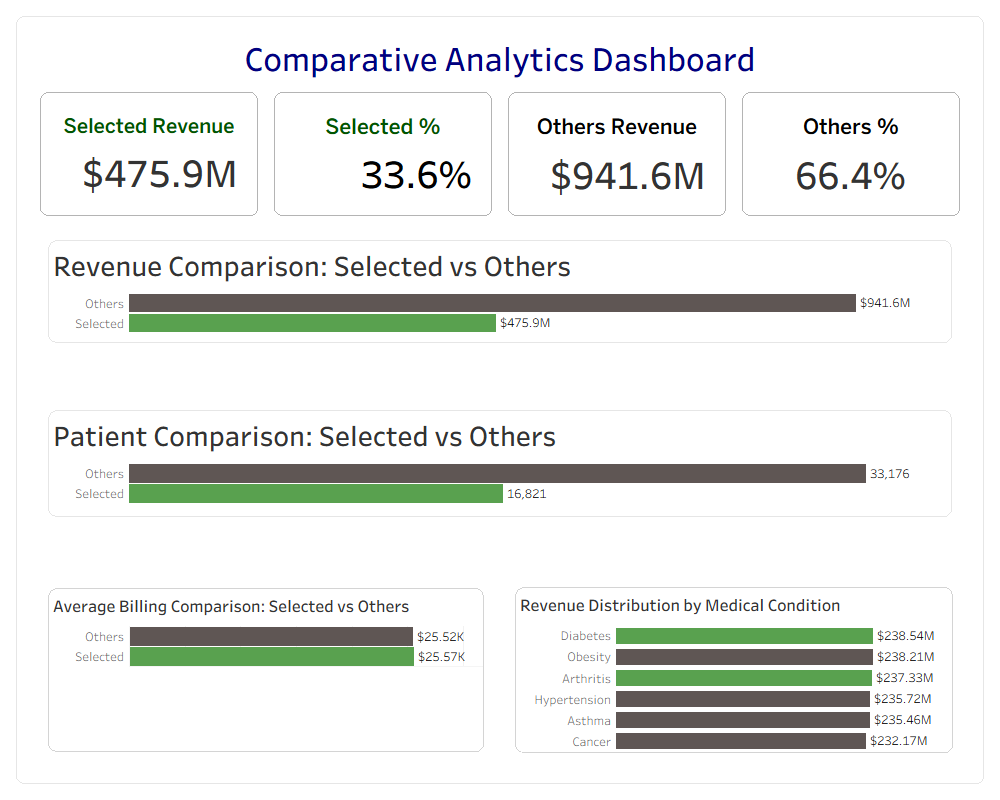
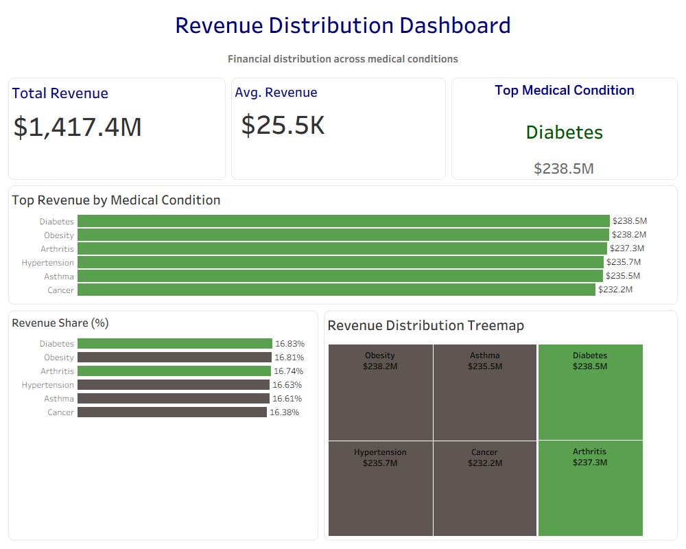
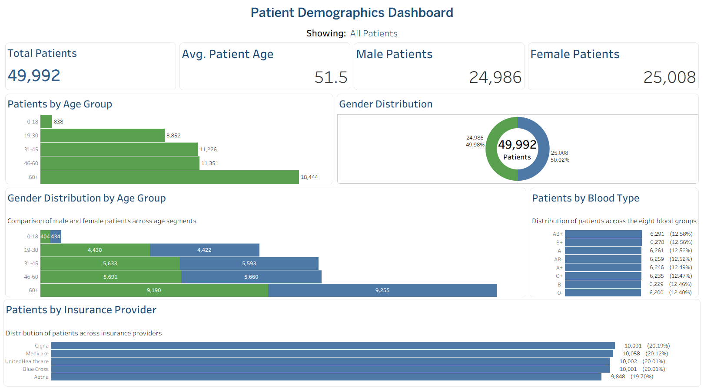
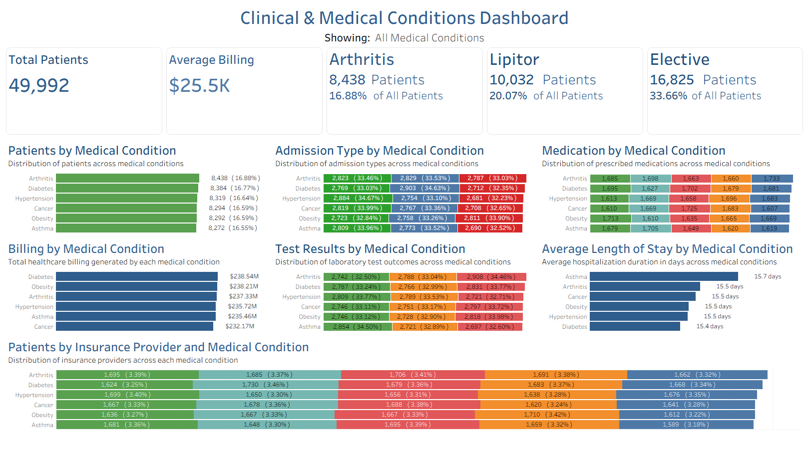
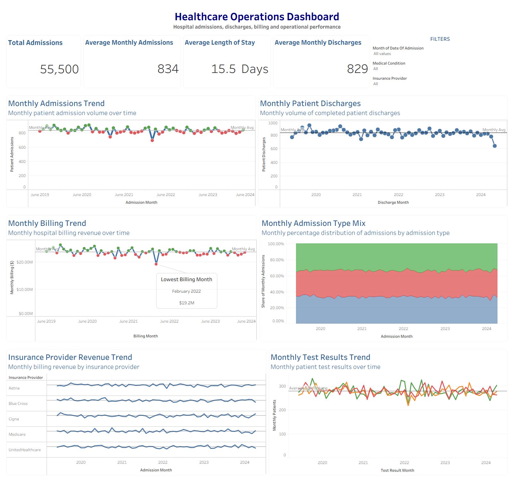
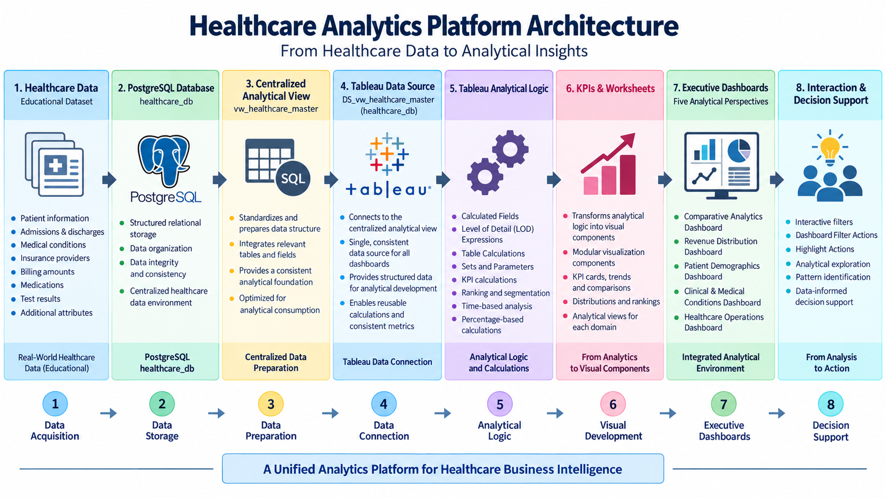

# Healthcare Analytics Platform

End-to-end Healthcare Business Intelligence portfolio project using PostgreSQL, SQL, and Tableau Desktop.

## Project Overview

The Healthcare Analytics Platform is an end-to-end Business Intelligence portfolio project designed to transform structured healthcare data into consistent, interactive, and decision-oriented analytical information.

The project combines PostgreSQL for centralized data management and analytical preparation with Tableau Desktop for calculations, KPIs, visualization, segmentation, and interactive dashboard development.

The final portfolio consists of five executive dashboards supported by a centralized PostgreSQL analytical View and a portable Tableau packaged workbook.

## Architecture & Technologies

The platform follows a layered analytical architecture:

**Healthcare Data → PostgreSQL `healthcare_db` → `vw_healthcare_master` → Tableau Analytics → KPIs & Worksheets → Executive Dashboards**

### Technology Stack

- **PostgreSQL** — relational database and centralized healthcare data management
- **SQL** — analytical preparation, validation, aggregation, and View development
- **Tableau Desktop** — calculated fields, KPIs, Sets, Table Calculations, visualizations, dashboards, filters, and interactive analysis
- **GitHub** — portfolio repository, documentation, SQL scripts, workbook, architecture, and dashboard presentation

## Analytical Architecture

The final PostgreSQL analytical architecture is centered on:

- Database: `healthcare_db`
- Centralized analytical View: `vw_healthcare_master`
- Tableau data source: `DS_vw_healthcare_master (healthcare_db)`

All five final executive dashboards use this centralized analytical foundation.

Additional PostgreSQL Views created during earlier learning and development stages are retained in the repository as SQL development artifacts but are not data sources for the five final dashboards.

## Key Analytical Capabilities

The final Tableau portfolio demonstrates:

- Calculated Fields
- Level of Detail (LOD) Expressions
- Table Calculations
- Tableau Sets
- Selected vs Others segmentation
- Ranking and contribution analysis
- Percent of Total calculations
- Standardized KPI development
- Time-based trend analysis
- Interactive filters
- Dashboard Filter Actions
- Highlight Actions
- Reusable analytical worksheets

## Five Executive Dashboards

### Comparative Analytics Dashboard

Provides Selected vs Others analysis across revenue, patient counts, percentages, average billing, and medical-condition distribution.



### Revenue Distribution Dashboard

Analyzes total revenue, average billing, top medical conditions, revenue ranking, contribution percentages, and treemap-based financial distribution.



### Patient Demographics Dashboard

Provides demographic analysis across patient age, gender, blood type, age groups, and insurance providers.



### Clinical & Medical Conditions Dashboard

Examines patient populations, medical conditions, medications, admission types, test results, billing activity, insurance providers, and length of stay.



### Healthcare Operations Dashboard

Provides operational visibility into admissions, discharges, billing trends, length of stay, admission-type patterns, insurance-provider revenue, test results, and monthly healthcare activity.



## Solution Architecture

The architecture diagram illustrates the analytical flow from the synthetic healthcare dataset through PostgreSQL, the centralized analytical View, Tableau analytics, KPIs, worksheets, and the final executive dashboard environment.



## Tableau Portfolio Workbook

The repository includes the final packaged Tableau workbook:

`tableau/Healthcare_Analytics_Platform.twbx`

The final workbook contains:

- 5 executive dashboards
- 44 supporting worksheets
- 1 centralized analytical data source
- 1 Tableau Set for comparative segmentation
- Reusable Calculated Fields and Table Calculations
- Interactive filters
- Dashboard Filter Actions
- Highlight Actions

The `.twbx` includes a Tableau extract, allowing the dashboards to be opened and reviewed without requiring access to the original local PostgreSQL environment.

## SQL Components

The repository includes SQL definitions verified directly from the completed PostgreSQL project.

### Centralized Analytical View

`sql/vw_healthcare_master.sql`

Contains the final PostgreSQL View used as the analytical foundation for the Tableau portfolio.

### Development Views

`sql/development_views.sql`

Contains twelve additional PostgreSQL Views created during development and learning stages of the project.

These Views demonstrate aggregation, grouping, ranking, KPI calculations, revenue analysis, and time-based SQL analysis.

## Dataset

The project uses the **Healthcare Dataset** created by **Prasad Patil (prasad22)** and published on Kaggle.

- Dataset: Healthcare Dataset
- Source file: `healthcare_dataset.csv`
- Dataset type: Synthetic healthcare data
- License: CC0: Public Domain
- Source: https://www.kaggle.com/datasets/prasad22/healthcare-dataset

The dataset contains synthetic healthcare information and does not contain real patient records.

The original CSV is not distributed separately in this repository. The final Tableau packaged workbook contains the analytical extract required for portfolio review.

## Repository Structure

```text
healthcare-analytics-platform/
│
├── README.md
│
├── docs/
│   └── README.md
│
├── sql/
│   ├── README.md
│   ├── vw_healthcare_master.sql
│   └── development_views.sql
│
├── tableau/
│   ├── README.md
│   └── Healthcare_Analytics_Platform.twbx
│
├── dashboards/
│   ├── README.md
│   ├── comparative_analytics.png
│   ├── revenue_distribution.png
│   ├── patient_demographics.png
│   ├── clinical_medical_conditions.png
│   └── healthcare_operations.png
│
├── architecture/
│   ├── README.md
│   └── healthcare_analytics_architecture.png
│
└── data/
    └── README.md
```

## Technical Skills Demonstrated

- PostgreSQL
- SQL
- Tableau Desktop
- Business Intelligence
- Healthcare Analytics
- Data Preparation
- Analytical View Development
- KPI Development
- Calculated Fields
- LOD Expressions
- Table Calculations
- Tableau Sets
- Ranking and Segmentation
- Interactive Dashboard Development
- Dashboard Actions
- Data Visualization
- Analytical Validation
- Technical Documentation

## Portfolio Focus

**Healthcare Data Analytics • Business Intelligence • Tableau Development • SQL Analytics**

## Project Status

The analytical platform, SQL components, Tableau workbook, architecture diagram, and executive dashboard gallery are completed.

Final published PDF documentation will be added to the docs/ folder after the portfolio documentation review is completed.
